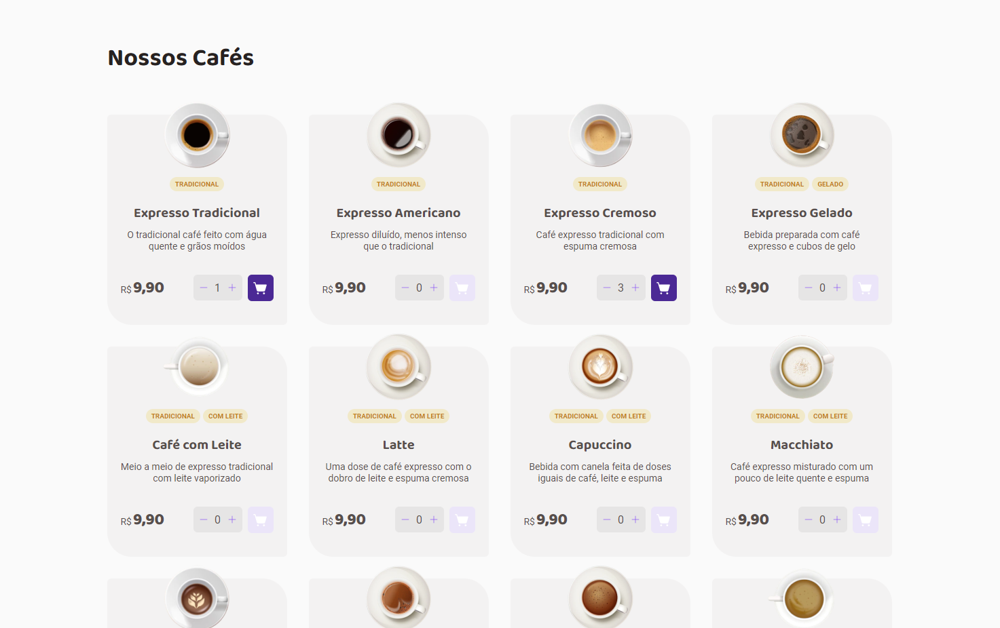
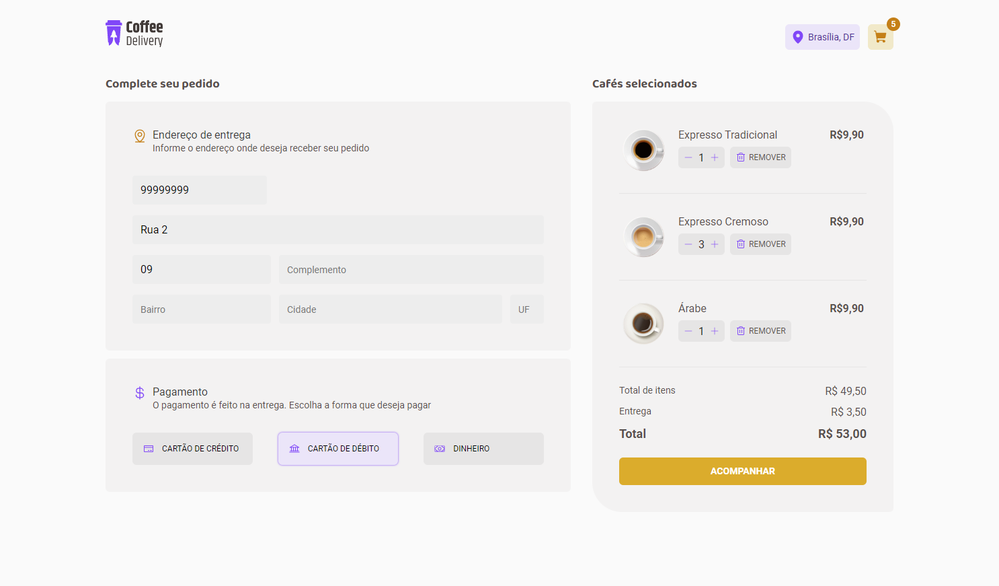
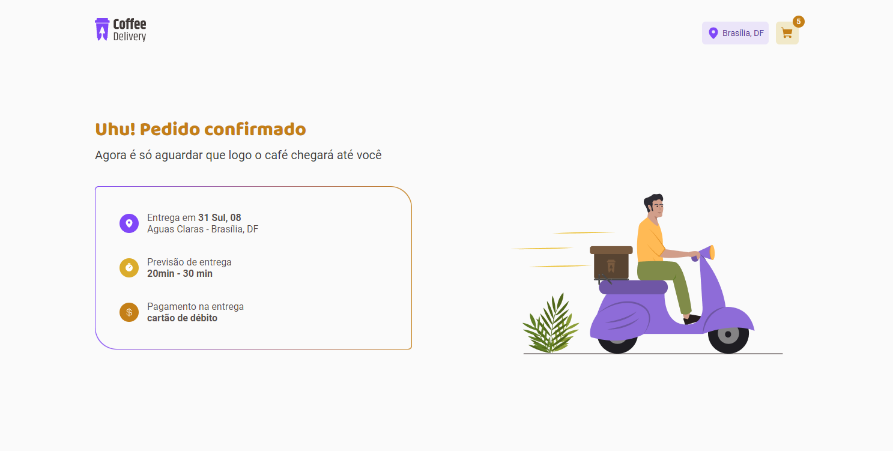

# Coffe Delivery

<strong>Coffe Delivery</strong> É uma aplicação desenvolvida em ReactJS para web que simula um delivery de cafés, onde é possível selecionar os cafés de sua preferência, informar seu endereço e selecionar a forma de pagamento. Trata-se de um projeto Front End onde o objetivo é performar da melhor forma todos os componentes.

### Tecnologias usadas nessa aplicação:

* React Ts
* React Hook Form
* Constexts
* Zod (Schema validation)
* Router Dom
* styled-components
* phosphor-reac

# Funcionamento

    

### Home

    

    

### Carrinho

    

### Pedido

    

